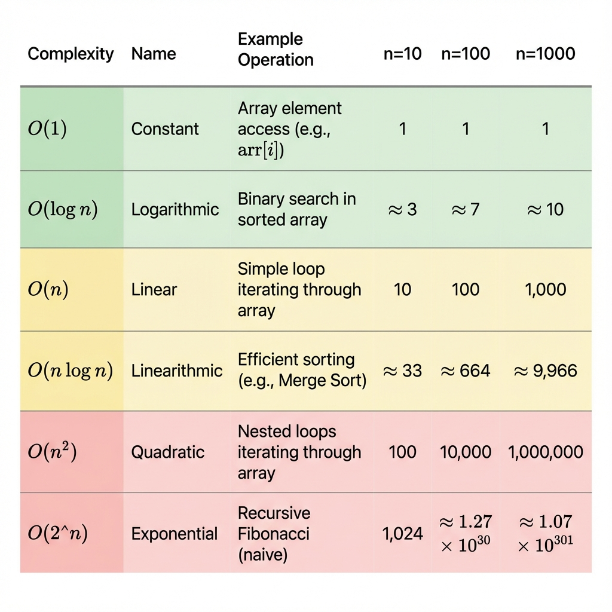

# Module 1: Big-O Notation and Complexity Analysis (Go Edition)

## Introduction

Big-O notation is the language we use to describe how efficient an algorithm is. It allows us to compare algorithms objectively and predict how they will perform as input sizes grow. Understanding Big-O is fundamental to technical interviews and software engineering.

Think of Big-O as answering the question: **"How does the runtime (or memory usage) of my algorithm grow as the input gets larger?"**

## Why Big-O Matters

### In Technical Interviews

Interviewers expect you to:
- Analyze the complexity of your solution
- Discuss tradeoffs between different approaches
- Recognize when a solution can be optimized
- Communicate efficiency using precise terminology

### In Real-World Engineering

Big-O helps you:
- Choose between algorithms for production systems
- Predict performance at scale
- Identify bottlenecks before they become problems
- Make informed architectural decisions

## What is Big-O Notation?

### The Intuition

Big-O notation describes the **upper bound** of an algorithm's growth rate. It tells us the worst-case scenario for how an algorithm's runtime or space usage grows relative to input size.

**Key Insight**: We care about growth rate, not exact runtime. An algorithm that takes 100n operations is fundamentally similar to one that takes 5n operations—both are linear, O(n).

### Formal Definition

For a function f(n), we say f(n) = O(g(n)) if there exist positive constants c and n₀ such that:

```
f(n) ≤ c × g(n) for all n ≥ n₀
```

**Translation**: After some point (n₀), f(n) grows no faster than g(n) multiplied by some constant.

### Practical Interpretation

When we say an algorithm is O(n²), we mean:
- The number of operations grows proportionally to n²
- Doubling the input size quadruples the operations
- Constants and lower-order terms don't matter for large n

## Rules for Calculating Big-O

### Rule 1: Drop Constants

```go
// Both of these are O(n), not O(2n) or O(3n)
for i := 0; i < n; i++ { }        // n operations
for i := 0; i < n; i++ { }        // n operations
// Total: 2n operations → O(n)

for i := 0; i < 3 * n; i++ { }    // 3n operations → O(n)
```

**Why**: Constants become insignificant as n grows large. O(2n) and O(n) grow at the same rate.

### Rule 2: Drop Lower-Order Terms

```go
// This is O(n²), not O(n² + n)
for i := 0; i < n; i++ {          // n operations
    // ...
}
for i := 0; i < n; i++ {          // n iterations
    for j := 0; j < n; j++ {      // n iterations each
        // ...
    }
}
// Total: n + n² operations → O(n²)
```

**Why**: For large n, n² dominates n. When n = 1000, n² = 1,000,000 while n = 1,000.

### Rule 3: Different Inputs Use Different Variables

```go
// This is O(a + b), not O(n)
for i := 0; i < a; i++ { }        // a operations
for i := 0; i < b; i++ { }        // b operations
// Total: O(a + b)

// This is O(a × b), not O(n²)
for i := 0; i < a; i++ {          // a iterations
    for j := 0; j < b; j++ {      // b iterations each
        // ...
    }
}
// Total: O(a × b)
```

**Why**: Different inputs may have different sizes. Don't assume they're the same.

### Rule 4: Consider All Branches

```go
// This is O(n), not O(1)
if condition {
    for i := 0; i < n; i++ { }    // O(n)
} else {
    // O(1)
}
// Worst case: O(n)
```

**Why**: Big-O describes the worst-case scenario unless otherwise specified.

## Common Complexity Classes




### O(1) - Constant Time

**Definition**: Runtime does not depend on input size.

**Characteristics**:
- Same number of operations regardless of n
- Best possible complexity
- Instant for any input size

**Examples**:
```go
// Slice access
value := arr[5]                        // O(1)

// Map get/put (average case)
val := m[key]                          // O(1)
m[key] = value                         // O(1)

// Arithmetic operations
sum := a + b                           // O(1)

// Fixed number of operations
result := arr[0] + arr[1] + arr[2]     // O(1)
```

**Real-World Example**: Looking up a value in a hash table, accessing a slice element by index.

**Interview Tip**: When you can solve a problem with direct access or calculation, you've achieved optimal time complexity.

---

### O(log n) - Logarithmic Time

**Definition**: Runtime grows logarithmically with input size.

**Characteristics**:
- Divides problem in half (or by constant factor) each step
- Very efficient, even for large inputs
- Common in divide-and-conquer algorithms

**Intuition**: If you double the input size, you only add one more step.

**Examples**:
```go
// Binary search
func binarySearch(arr []int, target int) int {
    left, right := 0, len(arr)-1
    
    for left <= right {
        mid := left + (right-left)/2
        
        if arr[mid] == target {
            return mid
        }
        if arr[mid] < target {
            left = mid + 1
        } else {
            right = mid - 1
        }
    }
    return -1
}
// Each iteration cuts search space in half → O(log n)
```

**Why It's Logarithmic**:
- Start with n elements
- After 1 step: n/2 elements
- After k steps: n/2^k elements
- When n/2^k = 1, we're done: k = log₂(n)

**Real-World Example**: Looking up a word in a dictionary (binary search), searching in a balanced binary search tree.

**Growth Rate**:
- n = 1,000 → ~10 operations
- n = 1,000,000 → ~20 operations

---

### O(n) - Linear Time

**Definition**: Runtime grows linearly with input size.

**Characteristics**:
- Must examine each element at least once
- Doubling input doubles runtime

**Examples**:
```go
// Single loop through slice
func findMax(arr []int) int {
    max := arr[0]
    for i := 1; i < len(arr); i++ {  // n iterations
        if arr[i] > max {
            max = arr[i]
        }
    }
    return max
}
// O(n)

// Loop with constant work inside
for i := 0; i < n; i++ {
    fmt.Println(arr[i])        // O(1) operation
}
// O(n) × O(1) = O(n)
```

**Real-World Example**: Finding an element in an unsorted slice, calculating the sum of all elements.

**Interview Tip**: If you must look at every element once, O(n) is optimal.

---

### O(n log n) - Linearithmic Time

**Definition**: Runtime is n multiplied by log n.

**Characteristics**:
- Common in efficient sorting algorithms
- Better than O(n²) but worse than O(n)

**Intuition**: Doing O(log n) work for each of n elements, or dividing n elements log n times.

**Examples**:
```go
// Merge Sort, Quick Sort (average), Heap Sort
// Standard Go sort:
sort.Ints(arr) // O(n log n)
```

**Why It's n log n** (Merge Sort Example):
- Tree has log n levels
- Each level processes all n elements
- Total: n × log n

**Real-World Example**: Sorting large datasets efficiently.

---

### O(n²) - Quadratic Time

**Definition**: Runtime grows with the square of input size.

**Characteristics**:
- Common in nested loops
- Becomes slow quickly as n grows

**Examples**:
```go
// Nested loops over same slice
func printPairs(arr []int) {
    for i := 0; i < len(arr); i++ {      // n iterations
        for j := 0; j < len(arr); j++ {  // n iterations each
            fmt.Printf("%d,%d\n", arr[i], arr[j])
        }
    }
}
// O(n²)
```

**Real-World Example**: Naive sorting algorithms (bubble sort), checking all pairs of elements.

**Growth Rate**:
- n = 1,000 → 1,000,000 operations

**Interview Tip**: If you have O(n²) and the problem involves searching or counting, consider using a Map to optimize to O(n).

---

### O(2^n) - Exponential Time

**Definition**: Runtime doubles with each additional input element.

**Characteristics**:
- Extremely slow for even moderate inputs
- Common in brute-force recursive solutions

**Examples**:
```go
// Recursive Fibonacci (naive)
func fibonacci(n int) int {
    if n <= 1 {
        return n
    }
    return fibonacci(n-1) + fibonacci(n-2)
}
// Each call makes 2 more calls → O(2^n)
```

**Real-World Example**: Brute-force password cracking, generating all possible combinations.

**Interview Tip**: If you have O(2^n), look for overlapping subproblems that can be cached (dynamic programming).

---

## Time Complexity vs Space Complexity

### Time Complexity

**Definition**: How runtime grows with input size.

**What We Count**: Number of primitive operations.

### Space Complexity

**Definition**: How memory usage grows with input size.

**What We Count**: Extra memory allocated (excluding input).

**Example**:
```go
// O(1) space - only using a few variables
func findMax(arr []int) int {
    max := arr[0]           // O(1) space
    // ...
    return max
}

// O(n) space - creating new slice
func doubleSlice(arr []int) []int {
    result := make([]int, len(arr))  // O(n) space
    // ...
    return result
}

// O(n) space - recursive call stack
func factorial(n int) int {
    if n <= 1 { return 1 }
    return n * factorial(n-1)
}
// Call stack depth: n → O(n) space
```

---

## Amortized Analysis

### Concept

Amortized analysis considers the average cost per operation over a sequence of operations.

### Example: Dynamic Array (Go Slice append)

```go
// Appending to slice
arr = append(arr, element)  // Usually O(1), occasionally O(n)
```

**How it works**:
- Most insertions are O(1) - just add to end
- Occasionally (when capacity full), resize backing array: O(n)
- Go doubles capacity (usually) when full.
- Amortized cost per insertion: O(1)

**Conclusion**: Even though individual `append` can be O(n), the amortized cost is O(1).

---

## Common Mistakes and Misconceptions

### Mistake 1: Confusing O(n) with O(n²)

```go
// This is O(n), NOT O(n²)
for i := 0; i < n; i++ {
    for j := 0; j < 100; j++ {  // Constant 100, not n
        // ...
    }
}
// O(n) × O(1) = O(n)
```

### Mistake 2: Forgetting About Space Complexity

```go
// Time: O(n), Space: O(n)
func createSlice(n int) []int {
    arr := make([]int, n)  // O(n) space!
    for i := 0; i < n; i++ {
        arr[i] = i
    }
    return arr
}
```

### Mistake 3: Assuming Map is Always O(1)

```go
val := m[key]  // O(1) average, O(n) worst case (hash collisions)
```

### Mistake 4: Not Considering All Operations

```go
// This is O(n²), not O(n)
for i := 0; i < n; i++ {
    s := ""
    for j := 0; j < n; j++ {
        s += "a"  // String concatenation creates new string! O(n)
    }
}
// O(n) × O(n) × O(n) = O(n³) actually!
```

---

## Summary

### Complexity Hierarchy (Best to Worst)

```
O(1) < O(log n) < O(n) < O(n log n) < O(n²) < O(2^n) < O(n!)
```

### Key Takeaways

1. **Big-O describes growth rate**, not exact operations
2. **Drop constants and lower-order terms**
3. **Different inputs need different variables**
4. **Consider worst-case unless specified otherwise**
5. **Analyze both time and space complexity**
6. **Practice recognizing patterns in code**

### Next Steps

1. Review the [Complexity Cheatsheet](complexity-cheatsheet.md)
2. Practice with [Complexity Analysis Exercises](practice-exercises.md)
3. Apply this knowledge in [Module 2: Core Data Structures](../module-2-core-data-structures/README.md)
