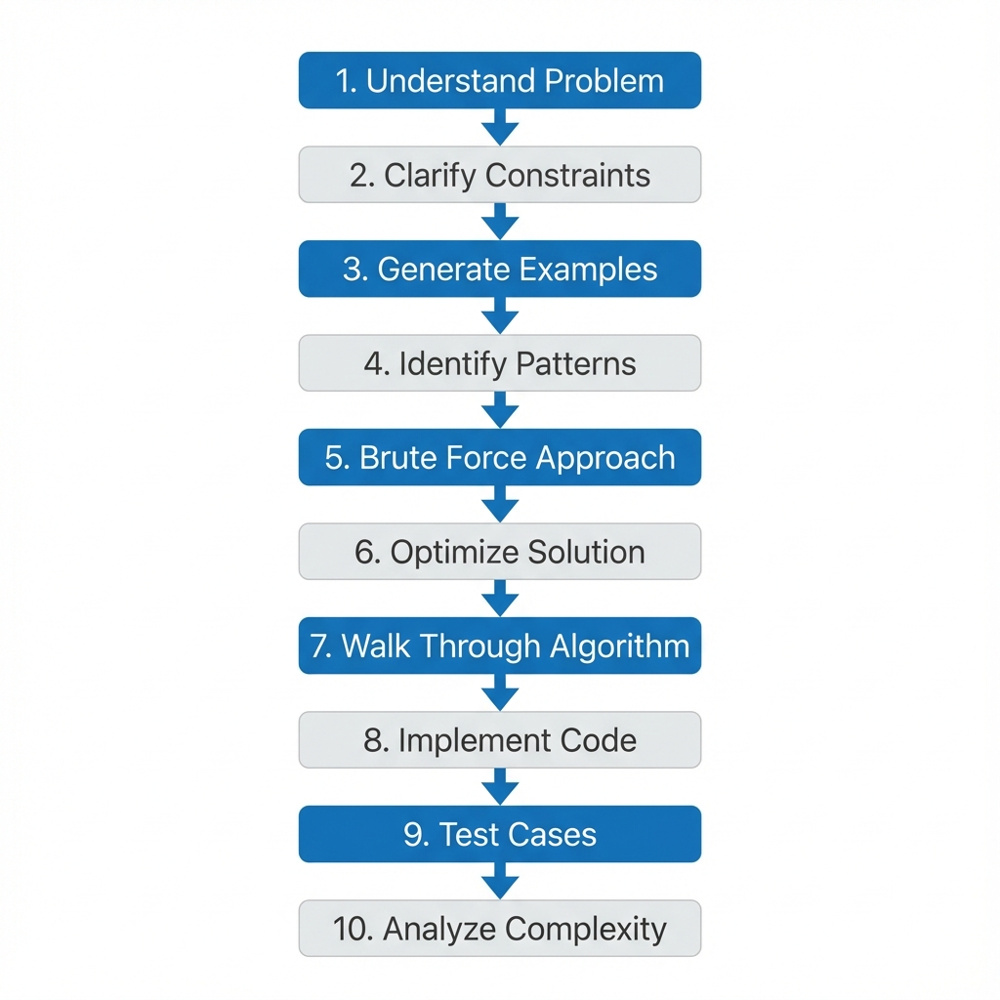

# Module 0.2: Problem-Solving Framework

## Introduction

The difference between candidates who succeed in technical interviews and those who struggle often comes down to having a systematic approach. This module introduces a proven 10-step framework that provides structure to your problem-solving process, ensures you communicate effectively, and helps you avoid common pitfalls.

This framework is not just for interviews. It represents best practices in software engineering problem-solving that will serve you throughout your career.

## The 10-Step Problem-Solving Framework



### Step 1: Understand the Problem

**Objective**: Ensure you fully comprehend what is being asked before attempting a solution.

**Actions**:
- Read the problem statement carefully, multiple times if necessary
- Identify the input format and constraints
- Identify the expected output format
- Rephrase the problem in your own words
- Ask yourself: "What is the core question being asked?"

**Common Mistakes to Avoid**:
- Jumping to coding without understanding
- Making assumptions about unstated requirements
- Misunderstanding the output format

**Example**:
```
Problem: "Find the longest substring without repeating characters."

Understanding:
- Input: A string
- Output: An integer (length of longest substring)
- Core question: What is the maximum length of a contiguous sequence 
  of characters where no character appears more than once?
```

---

### Step 2: Clarify Constraints and Edge Cases

**Objective**: Establish the boundaries of the problem space and identify special cases that need handling.

**Questions to Ask**:
- What is the range of input sizes? (e.g., "Can the array be empty?")
- What are the value constraints? (e.g., "Can numbers be negative?")
- Are there any special cases? (e.g., "What if all elements are the same?")
- What should be returned for invalid inputs?
- Are there performance requirements?

**Why This Matters**:
- Prevents wasted time solving the wrong problem
- Demonstrates thoroughness and professionalism
- Helps identify edge cases early

**Example Questions**:
```
For "Find two numbers that sum to target":
- Can the array be empty? (Edge case)
- Can it contain duplicates? (Affects approach)
- Can I use the same element twice? (Constraint)
- Is the array sorted? (Optimization opportunity)
- What if no solution exists? (Error handling)
```

---

### Step 3: Generate Examples

**Objective**: Create concrete test cases that help you understand the problem and verify your solution.

**Types of Examples to Create**:

1. **Normal Case**: Typical input with straightforward output
2. **Edge Cases**: 
   - Empty input
   - Single element
   - All elements the same
   - Maximum/minimum values
3. **Complex Case**: Larger input that tests the full algorithm

**Format**:
```
Input: [specific values]
Output: [expected result]
Explanation: [why this is the output]
```

**Example**:
```
Problem: Two Sum

Normal Case:
Input: nums = [2, 7, 11, 15], target = 9
Output: [0, 1]
Explanation: nums[0] + nums[1] = 2 + 7 = 9

Edge Case (small input):
Input: nums = [3, 3], target = 6
Output: [0, 1]
Explanation: Both elements sum to target

Edge Case (no duplicates):
Input: nums = [1, 2, 3, 4], target = 7
Output: [2, 3]
Explanation: 3 + 4 = 7
```

---

### Step 4: Identify Patterns and Data Structures

**Objective**: Recognize which algorithmic patterns and data structures are applicable to this problem.

**Common Patterns**:
- Two Pointers (sorted arrays, palindromes)
- Sliding Window (subarray/substring problems)
- Hash Map (lookups, counting, pairs)
- Stack (nested structures, monotonic sequences)
- Binary Search (sorted data, optimization)
- DFS/BFS (trees, graphs, exploration)
- Dynamic Programming (optimization, counting ways)

**Questions to Ask Yourself**:
- Have I seen a similar problem before?
- What data structure would make lookups/insertions efficient?
- Is there a mathematical property I can exploit?
- Can I sort the data to simplify the problem?

**Example**:
```
Problem: Two Sum

Pattern Recognition:
- Need to find pairs → suggests HashMap
- Looking for complement → store what we've seen
- O(1) lookup needed → HashMap over array

Data Structure Choice: HashMap<Integer, Integer>
- Key: number value
- Value: index in array
```

---

### Step 5: Develop Brute Force Approach

**Objective**: Create a simple, correct solution without worrying about optimization.

**Why Start with Brute Force**:
- Guarantees you have a working solution
- Provides a baseline for optimization
- Demonstrates problem-solving ability
- Often reveals optimization opportunities

**Process**:
1. Describe the simplest possible approach
2. State its time and space complexity
3. Acknowledge it may not be optimal
4. Use it as a starting point for optimization

**Example**:
```
Problem: Two Sum

Brute Force Approach:
"I'll use nested loops to check every pair of numbers. 
For each element at index i, I'll check every element at 
index j (where j > i) to see if they sum to the target."

Complexity:
- Time: O(n²) - checking all pairs
- Space: O(1) - no extra data structures

Code Sketch:
for i in 0 to n-1:
    for j in i+1 to n-1:
        if nums[i] + nums[j] == target:
            return [i, j]
```

---

### Step 6: Optimize the Solution

**Objective**: Improve time or space complexity by identifying bottlenecks and applying optimizations.

**Optimization Strategies**:

1. **Identify the Bottleneck**: What operation is repeated unnecessarily?
2. **Trade Space for Time**: Can a data structure eliminate redundant work?
3. **Eliminate Redundant Work**: Are you recalculating the same values?
4. **Use Better Data Structures**: Can you improve lookup/insertion time?
5. **Apply Patterns**: Does a known pattern solve this more efficiently?

**Questions to Ask**:
- What is the theoretical best possible complexity?
- What am I doing repeatedly that could be cached?
- Can I solve this in a single pass?
- Is there a mathematical insight that simplifies the problem?

**Example**:
```
Problem: Two Sum

Bottleneck Analysis:
- Brute force checks every pair: O(n²)
- For each number x, we search for (target - x)
- Searching takes O(n) in array, but O(1) in HashMap

Optimization:
"Instead of searching for the complement each time, I'll 
store numbers I've seen in a HashMap. For each number, I 
check if its complement exists in O(1) time."

Optimized Complexity:
- Time: O(n) - single pass
- Space: O(n) - HashMap storage

This is optimal because we must examine each element at least once.
```

---

### Step 7: Walk Through Algorithm with Example

**Objective**: Verify your algorithm logic by manually executing it on a concrete example.

**Process**:
1. Choose one of your examples from Step 3
2. Execute your algorithm step-by-step
3. Track variable states at each step
4. Verify the output matches expectations
5. Check edge cases

**Format**:
```
Example: [input]
Target: [expected output]

Step-by-step execution:
Iteration 1: [state of variables] → [action taken]
Iteration 2: [state of variables] → [action taken]
...
Final result: [output] ✓
```

**Example**:
```
Problem: Two Sum
Input: nums = [2, 7, 11, 15], target = 9

Algorithm Walkthrough:
Initial state: map = {}, i = 0

i = 0, nums[0] = 2:
  complement = 9 - 2 = 7
  map.contains(7)? No
  map.put(2, 0)
  map = {2: 0}

i = 1, nums[1] = 7:
  complement = 9 - 7 = 2
  map.contains(2)? Yes!
  return [map.get(2), 1] = [0, 1] ✓

Result matches expected output.
```

---

### Step 8: Implement with Clean Code

**Objective**: Write production-quality code that is readable, maintainable, and correct.

**Code Quality Principles**:

1. **Meaningful Names**: Use descriptive variable and function names
2. **Clear Structure**: Organize code logically with proper spacing
3. **Comments**: Explain complex logic and algorithm overview
4. **Edge Cases**: Handle boundary conditions explicitly
5. **Consistency**: Follow language conventions and style guides

**Best Practices**:
```java
// Good: Descriptive names and clear structure
public int[] twoSum(int[] nums, int target) {
    Map<Integer, Integer> numToIndex = new HashMap<>();
    
    for (int i = 0; i < nums.length; i++) {
        int complement = target - nums[i];
        
        if (numToIndex.containsKey(complement)) {
            return new int[] {numToIndex.get(complement), i};
        }
        
        numToIndex.put(nums[i], i);
    }
    
    return new int[] {}; // No solution found
}

// Bad: Unclear names and poor structure
public int[] ts(int[] a, int t) {
    Map<Integer,Integer> m=new HashMap<>();
    for(int i=0;i<a.length;i++){
        int c=t-a[i];
        if(m.containsKey(c))return new int[]{m.get(c),i};
        m.put(a[i],i);}
    return new int[]{};}
```

**While Coding**:
- Think aloud to explain what you're writing
- Write incrementally, not all at once
- Use proper indentation and spacing
- Add comments for non-obvious logic

---

### Step 9: Test with Examples

**Objective**: Verify correctness by executing your code with test cases, including edge cases.

**Testing Strategy**:

1. **Test Normal Cases**: Use examples from Step 3
2. **Test Edge Cases**: Empty input, single element, boundaries
3. **Test Complex Cases**: Larger inputs that stress the algorithm
4. **Debug Systematically**: If tests fail, trace through execution

**Testing Process**:
```
1. State the test case clearly
2. Trace through code line by line
3. Track variable values at each step
4. Verify output matches expectation
5. If incorrect, identify where logic fails
```

**Example**:
```
Test Case 1: Normal case
Input: nums = [2, 7, 11, 15], target = 9
Expected: [0, 1]

Execution:
- i=0: complement=7, map={}, add 2→0
- i=1: complement=2, found at index 0, return [0,1] ✓

Test Case 2: Edge case (duplicates)
Input: nums = [3, 3], target = 6
Expected: [0, 1]

Execution:
- i=0: complement=3, map={}, add 3→0
- i=1: complement=3, found at index 0, return [0,1] ✓

Test Case 3: Edge case (no solution - wait, problem guarantees solution)
Not applicable given constraints.

All tests pass ✓
```

---

### Step 10: Analyze Complexity and Discuss Tradeoffs

**Objective**: Demonstrate understanding of your solution's efficiency and alternative approaches.

**Complexity Analysis**:

1. **Time Complexity**: 
   - Count operations as a function of input size
   - Consider best, average, and worst cases
   - Explain the dominant operations

2. **Space Complexity**:
   - Count extra memory used
   - Don't count input or output space
   - Consider auxiliary data structures

**Discussion Points**:
- Is this the optimal solution?
- What are the tradeoffs between different approaches?
- When would you choose one approach over another?
- Are there alternative solutions worth mentioning?

**Example**:
```
Problem: Two Sum

Time Complexity: O(n)
- Single pass through array: n iterations
- HashMap operations (get, put, containsKey): O(1) average
- Total: O(n)

Space Complexity: O(n)
- HashMap stores up to n elements in worst case
- Other variables use O(1) space
- Total: O(n)

Tradeoffs:
- Brute Force: O(n²) time, O(1) space
- HashMap: O(n) time, O(n) space
- We trade space for time, which is worthwhile for large inputs

This is optimal because:
- Must examine each element at least once: Ω(n)
- Our solution examines each element exactly once: O(n)
- Therefore, this is the best possible time complexity

Alternative Approaches:
- If array were sorted: Two-pointer technique, O(n) time, O(1) space
- For multiple queries: Preprocessing might be beneficial
```

---

## Framework Application Workflow

When solving any problem, follow this sequence:

```
1. UNDERSTAND → Read and rephrase the problem
2. CLARIFY → Ask about constraints and edge cases
3. EXAMPLES → Generate 3-5 test cases
4. PATTERNS → Identify applicable techniques
5. BRUTE FORCE → Develop simple solution
6. OPTIMIZE → Improve complexity
7. WALKTHROUGH → Verify with example
8. IMPLEMENT → Write clean code
9. TEST → Verify with all test cases
10. ANALYZE → Discuss complexity and tradeoffs
```

**Time Allocation** (for 45-minute problem):
- Steps 1-6: 10-15 minutes (thinking and planning)
- Steps 7-8: 15-20 minutes (coding)
- Steps 9-10: 10-15 minutes (testing and discussion)

## Why This Framework Works

1. **Reduces Anxiety**: Provides clear structure when under pressure
2. **Demonstrates Competency**: Shows systematic thinking
3. **Catches Errors Early**: Testing and verification built in
4. **Improves Communication**: Natural points for verbalization
5. **Ensures Completeness**: Nothing important is forgotten
6. **Builds Confidence**: Repeatable process that works

## Common Pitfalls and How Framework Prevents Them

| Pitfall | How Framework Helps |
|---------|-------------------|
| Jumping to code too quickly | Steps 1-6 force planning first |
| Missing edge cases | Step 2 explicitly addresses this |
| Unable to optimize | Step 5-6 progression from brute force |
| Buggy code | Steps 7 and 9 catch errors |
| Poor communication | Framework provides natural talking points |
| Incomplete solution | All 10 steps ensure thoroughness |
| Wrong complexity analysis | Step 10 requires explicit analysis |

## Internalizing the Framework

**Week 1**: Consciously follow all 10 steps for every problem, even easy ones.

**Week 2**: The steps will start feeling natural. Focus on smooth transitions between steps.

**Week 3**: The framework becomes automatic. You'll think in this structure naturally.

**Week 4+**: The framework is internalized. You can adapt it flexibly while maintaining rigor.

## Practice Recommendations

1. **Apply to Every Problem**: Use this framework for all practice problems
2. **Practice Aloud**: Verbalize each step as you would in an interview
3. **Time Yourself**: Ensure you can complete all steps within time limits
4. **Review Recordings**: Record yourself and identify areas for improvement
5. **Get Feedback**: Have others evaluate your framework application

## Next Steps

1. Review the [Framework Template](framework-template.md) for a quick reference
2. Study the [Two Sum Walkthrough](examples/two-sum-walkthrough.md) to see the framework in action
3. Practice with the [Framework Practice Problems](practice-problems.md)
4. Apply this framework to every problem you solve going forward

---

**Remember**: This framework is a tool, not a rigid script. Adapt it to the problem and interview context, but ensure you hit all the key points. With practice, it will become second nature and significantly improve your interview performance.
