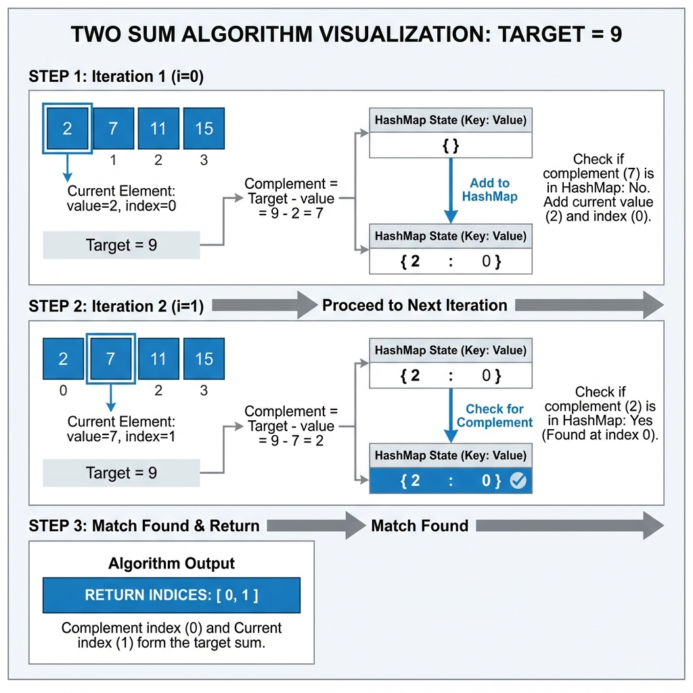

# Two Sum - Complete Framework Walkthrough

This document demonstrates the complete application of the 10-step problem-solving framework to the Two Sum problem. Study this example to understand how each step flows naturally into the next.

---

## Step 1: Understand the Problem

### Problem Statement (Original)

Given an array of integers `nums` and an integer `target`, return indices of the two numbers such that they add up to `target`. You may assume that each input would have exactly one solution, and you may not use the same element twice.

### Problem Statement (My Own Words)

I need to find two distinct elements in an array that sum to a given target value. Instead of returning the values themselves, I return their positions (indices) in the array. The problem guarantees exactly one valid pair exists.

### Input/Output Analysis

**Input**:
- `nums`: Array of integers
- `target`: Integer value we want two elements to sum to

**Output**:
- Array of two integers representing the indices

**Core Question**: Which two positions in the array contain values that add up to the target?

---

## Step 2: Clarify Constraints and Edge Cases

### Questions I Would Ask in an Interview

**Q**: Can the array contain negative numbers or zeros?  
**A**: Yes, any integers are valid.

**Q**: Is the array sorted?  
**A**: No, assume it's unsorted.

**Q**: Can I use the same element twice (e.g., if target is 6 and array has [3, 5, 7])?  
**A**: No, you must use two distinct indices.

**Q**: What if multiple pairs sum to the target?  
**A**: The problem guarantees exactly one solution, so this won't happen.

**Q**: What's the minimum array size?  
**A**: At least 2 elements (since we need a pair).

**Q**: Are there any performance requirements?  
**A**: (In a real interview, this might lead to discussing optimal solutions)

### Constraints Summary

- Array length: ≥ 2
- Values: Any integers (positive, negative, zero)
- Array order: Unsorted
- Solution uniqueness: Exactly one valid pair
- Index usage: Must use two distinct indices

### Edge Cases to Consider

1. **Minimum size**: Array with exactly 2 elements
2. **Duplicates**: Array contains duplicate values
3. **Negative numbers**: Target or array values are negative
4. **Zero**: Target is zero or array contains zeros

---

## Step 3: Generate Examples

### Example 1: Normal Case

```
Input: nums = [2, 7, 11, 15], target = 9
Output: [0, 1]
Explanation: nums[0] + nums[1] = 2 + 7 = 9
```

### Example 2: Duplicates Present

```
Input: nums = [3, 2, 4], target = 6
Output: [1, 2]
Explanation: nums[1] + nums[2] = 2 + 4 = 6
Note: We cannot use nums[0] twice even though 3 + 3 = 6
```

### Example 3: Edge Case - Minimum Size

```
Input: nums = [1, 2], target = 3
Output: [0, 1]
Explanation: Only two elements, they must be the answer
```

### Example 4: Negative Numbers

```
Input: nums = [-1, -2, -3, -4, -5], target = -8
Output: [2, 4]
Explanation: nums[2] + nums[4] = -3 + (-5) = -8
```

### Example 5: With Duplicates

```
Input: nums = [3, 3], target = 6
Output: [0, 1]
Explanation: Two different indices, both happen to have value 3
```

---

## Step 4: Identify Patterns and Data Structures

### Pattern Recognition

This problem exhibits characteristics of the **Hash Map** pattern:
- Need to find a pair of elements with a specific relationship
- Looking for a "complement" for each element
- Need fast lookup to check if complement exists

### Similar Problems

- Three Sum (extension to three elements)
- Two Sum II (sorted array variant)
- Four Sum (further extension)

### Data Structure Analysis

**Option 1: Array/List**
- Searching for complement: O(n) per element
- Not optimal for lookups

**Option 2: Hash Map**
- Searching for complement: O(1) average
- Perfect for this use case

**Option 3: Hash Set**
- Can check existence but cannot store indices
- Need HashMap, not just Set

### Chosen Approach

**Data Structure**: `HashMap<Integer, Integer>`
- **Key**: The number value
- **Value**: The index where that number appears

**Why**: We need O(1) lookup to find complements and must track indices.

---

## Step 5: Develop Brute Force Approach

### Brute Force Description

Check every possible pair of elements in the array. For each element at index `i`, check every element at index `j` (where `j > i`) to see if they sum to the target.

### Algorithm

```
1. For i from 0 to n-2:
     For j from i+1 to n-1:
       If nums[i] + nums[j] == target:
         Return [i, j]
2. Return empty array (should never reach if solution guaranteed)
```

### Brute Force Code

```java
public int[] twoSumBruteForce(int[] nums, int target) {
    // Check all possible pairs
    for (int i = 0; i < nums.length - 1; i++) {
        for (int j = i + 1; j < nums.length; j++) {
            if (nums[i] + nums[j] == target) {
                return new int[] {i, j};
            }
        }
    }
    return new int[] {}; // No solution found
}
```

### Complexity Analysis

**Time Complexity**: O(n²)
- Outer loop: n iterations
- Inner loop: up to n iterations
- Total: n × n = n²

**Space Complexity**: O(1)
- Only using a few variables
- No additional data structures

### Why This Works

This approach is guaranteed to find the solution because it checks every possible pair. However, it's inefficient for large arrays.

---

## Step 6: Optimize the Solution

### Bottleneck Identification

The bottleneck is the inner loop that searches for the complement. For each element `x`, we spend O(n) time searching for `target - x`.

**Key Insight**: If we could look up whether `target - x` exists in O(1) time, we could solve this in O(n) time.

### Optimization Strategy

**Trade space for time**: Use a HashMap to store numbers we've seen along with their indices. For each new number, check if its complement already exists in the HashMap.

### Optimized Algorithm

```
1. Create empty HashMap
2. For each index i from 0 to n-1:
     complement = target - nums[i]
     If complement exists in HashMap:
       Return [HashMap.get(complement), i]
     Add nums[i] → i to HashMap
3. Return empty array (should never reach)
```

### Why This Works

- As we iterate, we store each number and its index
- Before storing, we check if the complement is already stored
- If complement exists, we've found our pair
- If not, we continue and store the current number for future lookups

### Optimized Complexity

**Time Complexity**: O(n)
- Single pass through array: n iterations
- HashMap operations (get, put, containsKey): O(1) average
- Total: O(n)

**Space Complexity**: O(n)
- HashMap stores up to n elements in worst case
- Worth the tradeoff for better time complexity

### Is This Optimal?

**Yes**, this is optimal because:
- We must examine each element at least once: Ω(n) lower bound
- Our solution examines each element exactly once: O(n)
- Therefore, we've achieved the theoretical minimum time complexity

---

## Step 7: Walk Through Algorithm with Example



### Example: nums = [2, 7, 11, 15], target = 9

**Initial State**:
```
nums = [2, 7, 11, 15]
target = 9
map = {}
```

**Iteration 1** (i = 0, nums[0] = 2):
```
complement = 9 - 2 = 7
map.containsKey(7)? No
Action: Add 2 → 0 to map
map = {2: 0}
```

**Iteration 2** (i = 1, nums[1] = 7):
```
complement = 9 - 7 = 2
map.containsKey(2)? Yes! (at index 0)
Action: Return [0, 1]
Result: [0, 1] ✓
```

### Verification

- nums[0] + nums[1] = 2 + 7 = 9 ✓
- Indices are distinct ✓
- Output format is correct ✓

### Edge Case Walkthrough: nums = [3, 3], target = 6

**Initial State**:
```
nums = [3, 3]
target = 6
map = {}
```

**Iteration 1** (i = 0, nums[0] = 3):
```
complement = 6 - 3 = 3
map.containsKey(3)? No
Action: Add 3 → 0 to map
map = {3: 0}
```

**Iteration 2** (i = 1, nums[1] = 3):
```
complement = 6 - 3 = 3
map.containsKey(3)? Yes! (at index 0)
Action: Return [0, 1]
Result: [0, 1] ✓
```

This correctly handles duplicates by finding the first occurrence in the map.

---

## Step 8: Implement with Clean Code

```java
/**
 * Two Sum - Find indices of two numbers that add up to target
 * 
 * Approach: Use HashMap to store numbers and their indices as we iterate.
 * For each number, check if its complement (target - number) exists in the map.
 * 
 * Time Complexity: O(n) - single pass through array
 * Space Complexity: O(n) - HashMap storage
 * 
 * @param nums Array of integers
 * @param target Target sum value
 * @return Array containing two indices whose values sum to target
 */
public int[] twoSum(int[] nums, int target) {
    // HashMap to store number -> index mapping
    // Key: number value, Value: index in array
    Map<Integer, Integer> numToIndex = new HashMap<>();
    
    // Single pass through array
    for (int i = 0; i < nums.length; i++) {
        // Calculate what number we need to find
        int complement = target - nums[i];
        
        // Check if we've seen the complement before
        if (numToIndex.containsKey(complement)) {
            // Found the pair! Return both indices
            return new int[] {numToIndex.get(complement), i};
        }
        
        // Haven't found complement yet, store current number for future lookups
        numToIndex.put(nums[i], i);
    }
    
    // No solution found (should never reach here given problem constraints)
    return new int[] {};
}
```

### Code Quality Checklist

- [x] Meaningful variable names (`numToIndex`, `complement`)
- [x] Clear comments explaining approach
- [x] Complexity analysis in documentation
- [x] Proper code structure with spacing
- [x] Edge cases handled (empty return)
- [x] Follows Java conventions

---

## Step 9: Test with Examples

### Test Case 1: Normal Case

```
Input: nums = [2, 7, 11, 15], target = 9
Expected: [0, 1]

Execution:
i=0: complement=7, map={}, add 2→0, map={2:0}
i=1: complement=2, found at 0, return [0,1]

Actual: [0, 1] ✓
Status: PASS
```

### Test Case 2: Different Pair

```
Input: nums = [3, 2, 4], target = 6
Expected: [1, 2]

Execution:
i=0: complement=3, map={}, add 3→0, map={3:0}
i=1: complement=4, map={3:0}, add 2→1, map={3:0, 2:1}
i=2: complement=2, found at 1, return [1,2]

Actual: [1, 2] ✓
Status: PASS
```

### Test Case 3: Edge Case - Minimum Size

```
Input: nums = [1, 2], target = 3
Expected: [0, 1]

Execution:
i=0: complement=2, map={}, add 1→0, map={1:0}
i=1: complement=1, found at 0, return [0,1]

Actual: [0, 1] ✓
Status: PASS
```

### Test Case 4: Duplicates

```
Input: nums = [3, 3], target = 6
Expected: [0, 1]

Execution:
i=0: complement=3, map={}, add 3→0, map={3:0}
i=1: complement=3, found at 0, return [0,1]

Actual: [0, 1] ✓
Status: PASS
```

### Test Case 5: Negative Numbers

```
Input: nums = [-1, -2, -3, -4, -5], target = -8
Expected: [2, 4]

Execution:
i=0: complement=-7, map={}, add -1→0
i=1: complement=-6, add -2→1
i=2: complement=-5, add -3→2
i=3: complement=-4, add -4→3
i=4: complement=-3, found at 2, return [2,4]

Actual: [2, 4] ✓
Status: PASS
```

### All Tests Passing: YES ✓

---

## Step 10: Analyze Complexity and Discuss Tradeoffs

### Final Time Complexity: O(n)

**Explanation**:
- We iterate through the array exactly once: n iterations
- For each iteration, we perform:
  - Subtraction: O(1)
  - HashMap containsKey: O(1) average
  - HashMap get: O(1) average
  - HashMap put: O(1) average
- Total: n × O(1) = O(n)

### Final Space Complexity: O(n)

**Explanation**:
- HashMap stores at most n elements in the worst case
- This occurs when the solution is the last pair checked
- Other variables (i, complement) use O(1) space
- Total: O(n)

### Approach Comparison

| Approach | Time | Space | Pros | Cons |
|----------|------|-------|------|------|
| Brute Force | O(n²) | O(1) | Simple, no extra space | Too slow for large inputs |
| HashMap | O(n) | O(n) | Optimal time, single pass | Uses extra space |
| Sorting + Two Pointers | O(n log n) | O(1) | No extra space | Slower than HashMap, loses original indices |

### When to Use Each Approach

**Brute Force**:
- Array is very small (n < 100)
- Memory is extremely constrained
- Simplicity is more important than performance

**HashMap (Optimal)**:
- Default choice for most cases
- When time complexity is critical
- When n can be large

**Sorting + Two Pointers**:
- Not applicable here (would lose original indices)
- Useful for "Two Sum II" variant with sorted input

### Follow-Up Questions and Answers

**Q**: What if the array was sorted?  
**A**: Could use two-pointer technique: one at start, one at end. Move pointers based on sum comparison. Still O(n) time but O(1) space.

**Q**: What if we needed to find all pairs that sum to target?  
**A**: Modify to collect all pairs instead of returning immediately. Handle duplicates carefully.

**Q**: What if we could use the same element twice?  
**A**: Check if `target / 2` exists in array and appears at least twice.

**Q**: How would you handle very large arrays that don't fit in memory?  
**A**: External sorting or distributed computing approaches would be needed.

---

## Key Takeaways

### What Made This Solution Strong

1. **Systematic Approach**: Followed all 10 steps methodically
2. **Clear Communication**: Explained thinking at each stage
3. **Optimization Path**: Started with brute force, then optimized
4. **Thorough Testing**: Tested multiple cases including edge cases
5. **Complexity Awareness**: Understood and explained time/space tradeoffs

### Patterns to Remember

- **Complement Pattern**: When looking for pairs that sum to X, store elements and look for (X - element)
- **HashMap for Pairs**: HashMap is ideal for pair-finding problems requiring O(1) lookup
- **Single Pass Optimization**: Often can solve in one pass by storing information as we go

### Similar Problems to Practice

- Two Sum II (sorted array)
- Three Sum
- Four Sum
- Two Sum III (data structure design)
- Subarray Sum Equals K

---

**This walkthrough demonstrates how the 10-step framework provides structure, ensures thoroughness, and leads to optimal solutions. Practice applying this framework to every problem you solve.**
