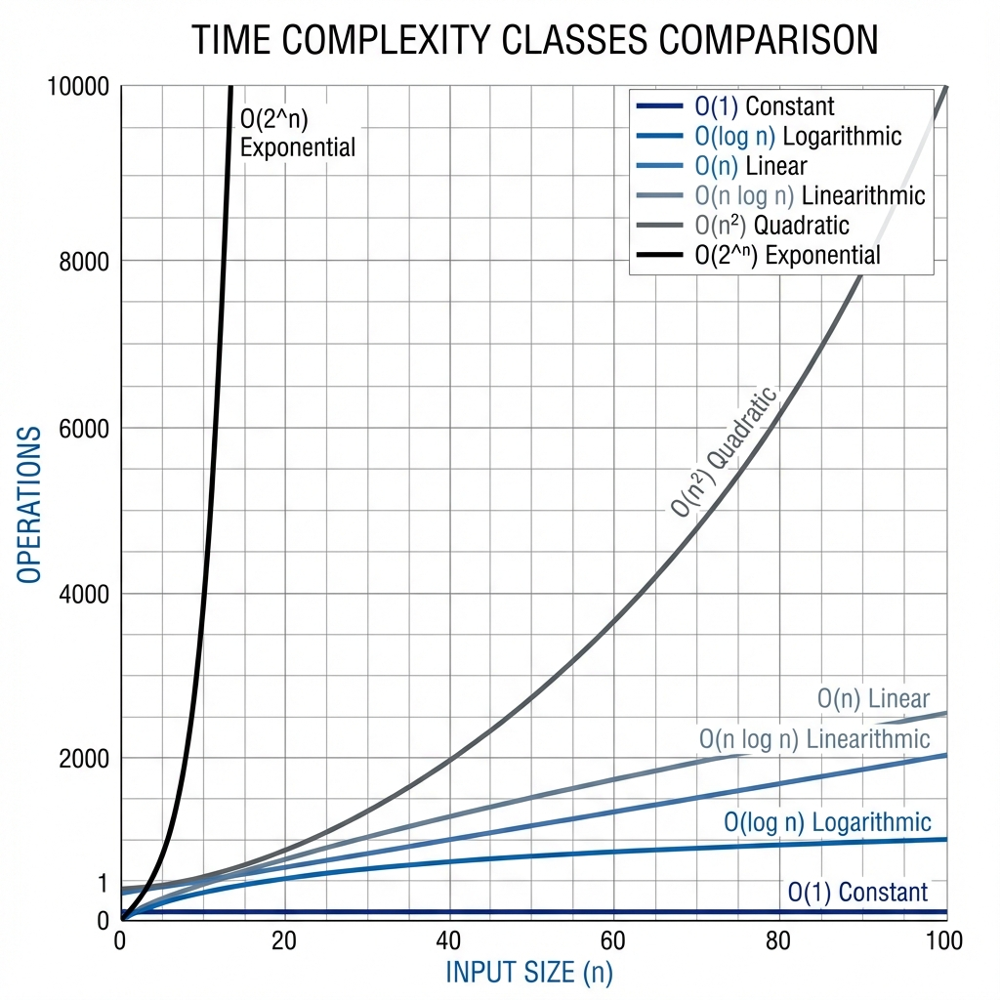

# Module 1: Big-O Notation and Complexity Analysis

## Introduction

Big-O notation is the language we use to describe how efficient an algorithm is. It allows us to compare algorithms objectively and predict how they will perform as input sizes grow. Understanding Big-O is fundamental to technical interviews and software engineering.

Think of Big-O as answering the question: **"How does the runtime (or memory usage) of my algorithm grow as the input gets larger?"**

## Why Big-O Matters

### In Technical Interviews

Interviewers expect you to:
- Analyze the complexity of your solution
- Discuss tradeoffs between different approaches
- Recognize when a solution can be optimized
- Communicate efficiency using precise terminology

### In Real-World Engineering

Big-O helps you:
- Choose between algorithms for production systems
- Predict performance at scale
- Identify bottlenecks before they become problems
- Make informed architectural decisions

## What is Big-O Notation?

### The Intuition

Big-O notation describes the **upper bound** of an algorithm's growth rate. It tells us the worst-case scenario for how an algorithm's runtime or space usage grows relative to input size.

**Key Insight**: We care about growth rate, not exact runtime. An algorithm that takes 100n operations is fundamentally similar to one that takes 5n operations—both are linear, O(n).

### Formal Definition

For a function f(n), we say f(n) = O(g(n)) if there exist positive constants c and n₀ such that:

```
f(n) ≤ c × g(n) for all n ≥ n₀
```

**Translation**: After some point (n₀), f(n) grows no faster than g(n) multiplied by some constant.

### Practical Interpretation

When we say an algorithm is O(n²), we mean:
- The number of operations grows proportionally to n²
- Doubling the input size quadruples the operations
- Constants and lower-order terms don't matter for large n

## Rules for Calculating Big-O

### Rule 1: Drop Constants

```java
// Both of these are O(n), not O(2n) or O(3n)
for (int i = 0; i < n; i++) { }        // n operations
for (int i = 0; i < n; i++) { }        // n operations
// Total: 2n operations → O(n)

for (int i = 0; i < 3 * n; i++) { }    // 3n operations → O(n)
```

**Why**: Constants become insignificant as n grows large. O(2n) and O(n) grow at the same rate.

### Rule 2: Drop Lower-Order Terms

```java
// This is O(n²), not O(n² + n)
for (int i = 0; i < n; i++) {          // n operations
    // ...
}
for (int i = 0; i < n; i++) {          // n iterations
    for (int j = 0; j < n; j++) {      // n iterations each
        // ...
    }
}
// Total: n + n² operations → O(n²)
```

**Why**: For large n, n² dominates n. When n = 1000, n² = 1,000,000 while n = 1,000.

### Rule 3: Different Inputs Use Different Variables

```java
// This is O(a + b), not O(n)
for (int i = 0; i < a; i++) { }        // a operations
for (int i = 0; i < b; i++) { }        // b operations
// Total: O(a + b)

// This is O(a × b), not O(n²)
for (int i = 0; i < a; i++) {          // a iterations
    for (int j = 0; j < b; j++) {      // b iterations each
        // ...
    }
}
// Total: O(a × b)
```

**Why**: Different inputs may have different sizes. Don't assume they're the same.

### Rule 4: Consider All Branches

```java
// This is O(n), not O(1)
if (condition) {
    for (int i = 0; i < n; i++) { }    // O(n)
} else {
    // O(1)
}
// Worst case: O(n)
```

**Why**: Big-O describes the worst-case scenario unless otherwise specified.

## Common Complexity Classes




### O(1) - Constant Time

**Definition**: Runtime does not depend on input size.

**Characteristics**:
- Same number of operations regardless of n
- Best possible complexity
- Instant for any input size

**Examples**:
```java
// Array access
int value = arr[5];                    // O(1)

// HashMap get/put (average case)
map.get(key);                          // O(1)
map.put(key, value);                   // O(1)

// Arithmetic operations
int sum = a + b;                       // O(1)

// Fixed number of operations
int result = arr[0] + arr[1] + arr[2]; // O(1)
```

**Real-World Example**: Looking up a value in a hash table, accessing an array element by index.

**Interview Tip**: When you can solve a problem with direct access or calculation, you've achieved optimal time complexity.

---

### O(log n) - Logarithmic Time

**Definition**: Runtime grows logarithmically with input size.

**Characteristics**:
- Divides problem in half (or by constant factor) each step
- Very efficient, even for large inputs
- Common in divide-and-conquer algorithms

**Intuition**: If you double the input size, you only add one more step.

**Examples**:
```java
// Binary search
int binarySearch(int[] arr, int target) {
    int left = 0, right = arr.length - 1;
    
    while (left <= right) {
        int mid = left + (right - left) / 2;
        
        if (arr[mid] == target) return mid;
        if (arr[mid] < target) left = mid + 1;
        else right = mid - 1;
    }
    return -1;
}
// Each iteration cuts search space in half → O(log n)

// Finding height of balanced binary tree
// Each level doubles the nodes, so height is log n
```

**Why It's Logarithmic**:
- Start with n elements
- After 1 step: n/2 elements
- After 2 steps: n/4 elements
- After 3 steps: n/8 elements
- After k steps: n/2^k elements
- When n/2^k = 1, we're done: k = log₂(n)

**Real-World Example**: Looking up a word in a dictionary (binary search), searching in a balanced binary search tree.

**Growth Rate**:
- n = 10 → ~3 operations
- n = 100 → ~7 operations
- n = 1,000 → ~10 operations
- n = 1,000,000 → ~20 operations

---

### O(n) - Linear Time

**Definition**: Runtime grows linearly with input size.

**Characteristics**:
- Must examine each element at least once
- Doubling input doubles runtime
- Often the best you can do when you need to process all data

**Examples**:
```java
// Single loop through array
int findMax(int[] arr) {
    int max = arr[0];
    for (int i = 1; i < arr.length; i++) {  // n iterations
        if (arr[i] > max) {
            max = arr[i];
        }
    }
    return max;
}
// O(n)

// Two sequential loops (still O(n))
for (int i = 0; i < n; i++) { }        // n operations
for (int i = 0; i < n; i++) { }        // n operations
// Total: 2n → O(n)

// Loop with constant work inside
for (int i = 0; i < n; i++) {
    System.out.println(arr[i]);        // O(1) operation
}
// O(n) × O(1) = O(n)
```

**Real-World Example**: Finding an element in an unsorted array, calculating the sum of all elements.

**Interview Tip**: If you must look at every element once, O(n) is optimal. Don't try to optimize further.

---

### O(n log n) - Linearithmic Time

**Definition**: Runtime is n multiplied by log n.

**Characteristics**:
- Common in efficient sorting algorithms
- Better than O(n²) but worse than O(n)
- Often the best achievable for comparison-based sorting

**Intuition**: Doing O(log n) work for each of n elements, or dividing n elements log n times.

**Examples**:
```java
// Merge Sort
void mergeSort(int[] arr, int left, int right) {
    if (left < right) {
        int mid = left + (right - left) / 2;
        
        mergeSort(arr, left, mid);         // Divide
        mergeSort(arr, mid + 1, right);    // Divide
        merge(arr, left, mid, right);      // Conquer: O(n)
    }
}
// Divides log n times, each level does O(n) work → O(n log n)

// Quick Sort (average case)
// Heap Sort
// Many divide-and-conquer algorithms
```

**Why It's n log n** (Merge Sort Example):
- Tree has log n levels (each level divides by 2)
- Each level processes all n elements
- Total: n × log n

**Real-World Example**: Sorting large datasets efficiently, building certain tree structures.

**Growth Rate**:
- n = 10 → ~33 operations
- n = 100 → ~664 operations
- n = 1,000 → ~9,966 operations

---

### O(n²) - Quadratic Time

**Definition**: Runtime grows with the square of input size.

**Characteristics**:
- Common in nested loops
- Becomes slow quickly as n grows
- Often indicates room for optimization

**Intuition**: For each element, you process all elements.

**Examples**:
```java
// Nested loops over same array
void printPairs(int[] arr) {
    for (int i = 0; i < arr.length; i++) {      // n iterations
        for (int j = 0; j < arr.length; j++) {  // n iterations each
            System.out.println(arr[i] + "," + arr[j]);
        }
    }
}
// O(n²)

// Bubble Sort
void bubbleSort(int[] arr) {
    for (int i = 0; i < arr.length; i++) {
        for (int j = 0; j < arr.length - 1; j++) {
            if (arr[j] > arr[j + 1]) {
                swap(arr, j, j + 1);
            }
        }
    }
}
// O(n²)

// Checking all pairs
for (int i = 0; i < n; i++) {
    for (int j = i + 1; j < n; j++) {  // Even though j starts at i+1
        // ...                          // Still O(n²)
    }
}
```

**Real-World Example**: Naive sorting algorithms (bubble sort, selection sort), checking all pairs of elements.

**Growth Rate**:
- n = 10 → 100 operations
- n = 100 → 10,000 operations
- n = 1,000 → 1,000,000 operations

**Interview Tip**: If you have O(n²) and the problem involves searching or counting, consider using a HashMap to optimize to O(n).

---

### O(2^n) - Exponential Time

**Definition**: Runtime doubles with each additional input element.

**Characteristics**:
- Extremely slow for even moderate inputs
- Common in brute-force recursive solutions
- Usually indicates need for optimization (dynamic programming, memoization)

**Intuition**: Each element doubles the number of possibilities.

**Examples**:
```java
// Recursive Fibonacci (naive)
int fibonacci(int n) {
    if (n <= 1) return n;
    return fibonacci(n - 1) + fibonacci(n - 2);
}
// Each call makes 2 more calls → O(2^n)

// Generating all subsets
void generateSubsets(int[] arr, int index, List<Integer> current) {
    if (index == arr.length) {
        // Process subset
        return;
    }
    
    // Include current element
    current.add(arr[index]);
    generateSubsets(arr, index + 1, current);
    
    // Exclude current element
    current.remove(current.size() - 1);
    generateSubsets(arr, index + 1, current);
}
// 2 choices per element → O(2^n)
```

**Real-World Example**: Brute-force password cracking, generating all possible combinations.

**Growth Rate**:
- n = 10 → 1,024 operations
- n = 20 → 1,048,576 operations
- n = 30 → 1,073,741,824 operations

**Interview Tip**: If you have O(2^n), look for overlapping subproblems that can be cached (dynamic programming).

---

### O(n!) - Factorial Time

**Definition**: Runtime grows as the factorial of input size.

**Characteristics**:
- Worst possible complexity
- Only feasible for very small inputs (n < 12)
- Common in brute-force permutation problems

**Examples**:
```java
// Generating all permutations
void permute(int[] arr, int start) {
    if (start == arr.length) {
        // Process permutation
        return;
    }
    
    for (int i = start; i < arr.length; i++) {
        swap(arr, start, i);
        permute(arr, start + 1);
        swap(arr, start, i);  // Backtrack
    }
}
// n choices, then n-1, then n-2, ... → O(n!)
```

**Growth Rate**:
- n = 5 → 120 operations
- n = 10 → 3,628,800 operations
- n = 15 → 1,307,674,368,000 operations

---

## Time Complexity vs Space Complexity

### Time Complexity

**Definition**: How runtime grows with input size.

**What We Count**: Number of primitive operations (comparisons, assignments, arithmetic).

**Example**:
```java
int sum = 0;                    // 1 operation
for (int i = 0; i < n; i++) {   // n iterations
    sum += arr[i];              // 2 operations per iteration
}
// Total: 1 + 2n → O(n) time
```

### Space Complexity

**Definition**: How memory usage grows with input size.

**What We Count**: Extra memory allocated (excluding input).

**Example**:
```java
// O(1) space - only using a few variables
int findMax(int[] arr) {
    int max = arr[0];           // O(1) space
    for (int i = 1; i < arr.length; i++) {
        if (arr[i] > max) {
            max = arr[i];
        }
    }
    return max;
}

// O(n) space - creating new array
int[] doubleArray(int[] arr) {
    int[] result = new int[arr.length];  // O(n) space
    for (int i = 0; i < arr.length; i++) {
        result[i] = arr[i] * 2;
    }
    return result;
}

// O(n) space - recursive call stack
int factorial(int n) {
    if (n <= 1) return 1;
    return n * factorial(n - 1);
}
// Call stack depth: n → O(n) space
```

**Common Space Complexity Patterns**:
- **O(1)**: Fixed number of variables
- **O(n)**: Array/list proportional to input
- **O(n)**: Recursive call stack of depth n
- **O(n²)**: 2D array of size n×n

---

## Analyzing Code Complexity

### Single Loops

```java
// O(n) - loop runs n times
for (int i = 0; i < n; i++) {
    // O(1) work
}

// O(n) - loop runs n/2 times, but we drop constants
for (int i = 0; i < n; i += 2) {
    // O(1) work
}

// O(log n) - loop divides by 2 each time
for (int i = 1; i < n; i *= 2) {
    // O(1) work
}

// O(log n) - loop divides by 2 each time
for (int i = n; i > 0; i /= 2) {
    // O(1) work
}
```

### Nested Loops

```java
// O(n²) - n × n
for (int i = 0; i < n; i++) {
    for (int j = 0; j < n; j++) {
        // O(1) work
    }
}

// O(n²) - even though j starts at i, still quadratic
for (int i = 0; i < n; i++) {
    for (int j = i; j < n; j++) {
        // O(1) work
    }
}
// Iterations: n + (n-1) + (n-2) + ... + 1 = n(n+1)/2 → O(n²)

// O(n log n) - outer loop n times, inner loop log n times
for (int i = 0; i < n; i++) {
    for (int j = 1; j < n; j *= 2) {
        // O(1) work
    }
}
```

### Sequential Operations

```java
// O(n) - add the complexities
for (int i = 0; i < n; i++) { }     // O(n)
for (int i = 0; i < n; i++) { }     // O(n)
// Total: O(n) + O(n) = O(n)

// O(n²) - take the dominant term
for (int i = 0; i < n; i++) { }     // O(n)
for (int i = 0; i < n; i++) {       // O(n²)
    for (int j = 0; j < n; j++) { }
}
// Total: O(n) + O(n²) = O(n²)
```

### Recursive Complexity

**Master Theorem** (simplified):

For recursion of form: T(n) = a × T(n/b) + O(n^d)

- If a > b^d: O(n^(log_b(a)))
- If a = b^d: O(n^d × log n)
- If a < b^d: O(n^d)

**Examples**:
```java
// Binary Search: T(n) = T(n/2) + O(1)
// a=1, b=2, d=0 → a = b^d → O(log n)

// Merge Sort: T(n) = 2T(n/2) + O(n)
// a=2, b=2, d=1 → a = b^d → O(n log n)

// Binary Tree Traversal: T(n) = 2T(n/2) + O(1)
// a=2, b=2, d=0 → a > b^d → O(n)
```

---

## Best, Average, and Worst Case

### Definitions

- **Best Case**: Minimum operations for any input of size n
- **Average Case**: Expected operations for random input of size n
- **Worst Case**: Maximum operations for any input of size n

### Example: Linear Search

```java
int linearSearch(int[] arr, int target) {
    for (int i = 0; i < arr.length; i++) {
        if (arr[i] == target) {
            return i;
        }
    }
    return -1;
}
```

- **Best Case**: O(1) - target is first element
- **Average Case**: O(n/2) → O(n) - target is in middle on average
- **Worst Case**: O(n) - target is last element or not present

### Example: Quick Sort

- **Best Case**: O(n log n) - pivot always divides evenly
- **Average Case**: O(n log n) - random pivots
- **Worst Case**: O(n²) - pivot is always smallest/largest (already sorted)

### Interview Convention

**Unless specified otherwise, Big-O refers to worst-case complexity.**

---

## Amortized Analysis

### Concept

Amortized analysis considers the average cost per operation over a sequence of operations, even if individual operations might be expensive.

### Example: Dynamic Array (ArrayList)

```java
// Adding to ArrayList
list.add(element);  // Usually O(1), occasionally O(n)
```

**How it works**:
- Most insertions are O(1) - just add to end
- Occasionally (when full), resize array: O(n)
- Resizing happens at sizes: 1, 2, 4, 8, 16, 32, ...
- For n insertions, total cost: n + (1 + 2 + 4 + ... + n/2) < 2n
- Amortized cost per insertion: 2n/n = O(1)

**Conclusion**: Even though individual operations can be O(n), the amortized cost is O(1).

---

## Common Mistakes and Misconceptions

### Mistake 1: Confusing O(n) with O(n²)

```java
// This is O(n), NOT O(n²)
for (int i = 0; i < n; i++) {
    for (int j = 0; j < 100; j++) {  // Constant 100, not n
        // ...
    }
}
// O(n) × O(1) = O(n)
```

### Mistake 2: Forgetting About Space Complexity

```java
// Time: O(n), Space: O(n)
int[] createArray(int n) {
    int[] arr = new int[n];  // O(n) space!
    for (int i = 0; i < n; i++) {
        arr[i] = i;
    }
    return arr;
}
```

### Mistake 3: Assuming HashMap is Always O(1)

```java
map.get(key);  // O(1) average, O(n) worst case (hash collisions)
```

### Mistake 4: Not Considering All Operations

```java
// This is O(n²), not O(n)
for (int i = 0; i < n; i++) {
    String s = "";
    for (int j = 0; j < n; j++) {
        s += "a";  // String concatenation is O(n)!
    }
}
// O(n) × O(n) × O(n) = O(n³) actually!
```

---

## Practical Tips for Interviews

### 1. State Complexity Upfront

Before coding, say: "I'll start with a brute force O(n²) solution, then optimize to O(n) using a HashMap."

### 2. Analyze as You Code

While coding, explain: "This loop is O(n), and the HashMap lookup inside is O(1), so overall this is O(n)."

### 3. Discuss Tradeoffs

"I can solve this in O(n) time but it requires O(n) space. If space is constrained, I could use O(1) space with O(n²) time."

### 4. Know When You're Optimal

"This is O(n) and we must examine each element at least once, so this is optimal."

### 5. Recognize Patterns

- Nested loops → O(n²)
- Dividing by 2 → O(log n)
- Recursion with 2 branches → O(2^n)
- Sorting → O(n log n)

---

## Summary

### Complexity Hierarchy (Best to Worst)

```
O(1) < O(log n) < O(n) < O(n log n) < O(n²) < O(2^n) < O(n!)
```

### Key Takeaways

1. **Big-O describes growth rate**, not exact operations
2. **Drop constants and lower-order terms**
3. **Different inputs need different variables**
4. **Consider worst-case unless specified otherwise**
5. **Analyze both time and space complexity**
6. **Practice recognizing patterns in code**

### Next Steps

1. Review the [Complexity Cheatsheet](complexity-cheatsheet.md)
2. Practice with [Complexity Analysis Exercises](practice-exercises.md)
3. Study [Worked Examples](examples/)
4. Apply this knowledge in [Module 2: Core Data Structures](../module-2-core-data-structures/README.md)

---

**Mastering Big-O notation is like learning a new language. Initially it feels foreign, but with practice it becomes second nature. This skill will serve you in every technical interview and throughout your engineering career.**
